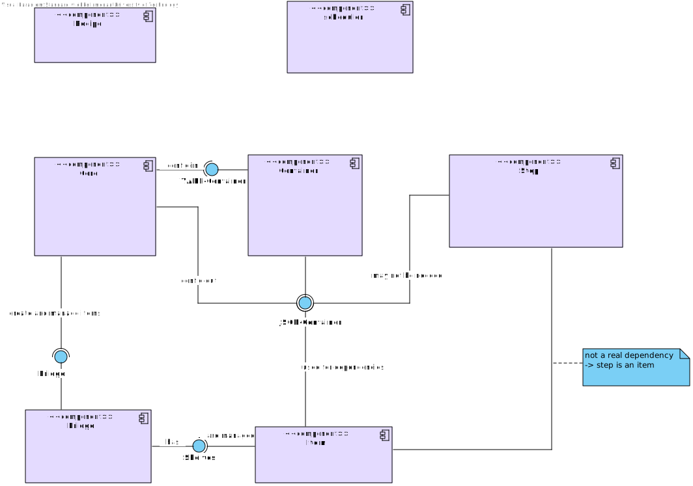

..  Copyright 2019 Christoph Wagner
        https://www.tu-ilmenau.de/it-ems/

    Licensed under the Apache License, Version 2.0 (the "License");
    you may not use this file except in compliance with the License.
    You may obtain a copy of the License at

        http://www.apache.org/licenses/LICENSE-2.0

    Unless required by applicable law or agreed to in writing, software
    distributed under the License is distributed on an "AS IS" BASIS,
    WITHOUT WARRANTIES OR CONDITIONS OF ANY KIND, either express or implied.
    See the License for the specific language governing permissions and
    limitations under the License.

.. _classes:

Structure
=========

Components
----------

The components diagram describes how the different components interact with each other.

Classes
-------

Core
^^^^^

.. mermaid::

  classDiagram

    class Chefkoch {
        <<Main instance>>
        cheffile : cheffile in YAML-Container
        configuration : Configurations
        logger : main Logger-instance
        fridge : Fridge
        recipe : Recipe
        plan : Plan
        scheduler : Scheduler
        cook(*targets) 
        __init__(firstpath, arguments)
        
    }

    class Configuration {
        <<of YAMLContainer>>
        items : map of configuration items
        file : container for information
        __init__(container, path, arguments): Load configuration
        __getitem__(keyname):  Retrieve a configuration item
        output(filename) : allows save configuration to a json-File
    }
    Configuration "1" --* "1" Chefkoch

    class Logger {
        options : options
        path : the path to main-directory
        __init__(options, path) Create a logfile and use this container for logging
        logspec(name, filename) : newLogger
        loglevel(level) : logLevel
    }
    Logger "1" --* "1" Chefkoch

    class Whitelist {
        __init__(*whitelist)
        filter(record): filters the entries
    }

Recipe
^^^^^^^

.. mermaid::

    classDiagram

    class Recipe {
        nodes: List of Node
        __init__(nodelist) Load Recipe from file
        __getitem__(item)
        inputIsOutput(input)
        inputIsValid(input)
        inputIntegrity()
        findCircles()
        recursiveDFS(node, nodesOnTheWay)
    }
    Plan --> Recipe
    Node --> Recipe

    class Plan {
        recipe : Recipe
        jobs : list of Result
        __init__(recipe, *targets)
    }
    Result --> Plan : list
    Scheduler --> Plan

    class Name {
        def __init__(name)
        def is_ascii(name)
    }

    class Flavour {
        tostring()
    }

    class StepSource {
        def __init__(self, stepsource)    
    }

    class FileParamValue {
        file : String
        key : String
        __init__(filepath, key)
        tostring()
    }

    class Node {
        __init__(name, inputdict, outputdict, stepsource)
    }

Scheduler
^^^^^^^^^

.. mermaid::

    classDiagram

    class Scheduler {
        chef : Chefkoch
        plan : Plan
        workers : list of Worker
        __init__(chef, Plan)
        update() Update current status of scheduler
    }

    class Worker {
        scheduler : Scheduler
    }
    Scheduler --> Worker

Container
^^^^^^^^^^

.. mermaid::

    classDiagram

    class JSONContainer {
        !!! Is Read-Only if filename is specified
        __init__(filename=str, data=dict) Create Container or load JSON from file
        __getitem__() Return element
        __setitem__() Add an element
        save(filename) saves dict to a given name
        hash() computes hash over dict
        __eq__(container) compares two dictionaries
        merge(container) update data with a information from different container
    }

    class YAMLContainer {
        !!! Is Read-Only
        filename : str
        data : Yaml-Container
        __init__(filename) Read YAML configuration
        __getitem__() Return element or subcontainer
        __hasattr__() Check if YAML contains an item of given name
        save() : None

    }

Step
^^^^^

.. mermaid::

    classDiagram

    class StepBuiltIn {
        <<abstract class of Step>>
    }

    class StepResource {
        <<abstract class of Step>>
        resource : Resource
        logger : new logger
        executeStep()
    }
    StepShell --|> StepResource
    StepPython --|> StepResource
    StepSubRecipe --|> StepResource

    class StepShell {
        <<of Step>>
        script : path to script
        __init__(shelf, depenendencies, logger)
        executeStep()
    }

    class StepPython {
        <<of Step>>
        module : python-module
        found : boolean
        __init__(shelf, dependencies, logger)
        executeStep()

    }

    class StepSubRecipe {
        <<of Step>>
    }

    class StepBuiltInCollect {
        <<of StepBuiltIn>>
    }
    StepBuiltInCollect --|> StepBuiltIn

    class Step {
        <<abstract class of Item>>
        mapping : dependencies
        __init__(shelf, dependencies)
    }
    StepResource --|> Step
    StepBuiltIn --|> Step

Item
^^^^^

.. mermaid::

    classDiagram

        class Item {
            <<abstract base class>>
            createHash() hashname
            checkHash() Bool
            check() Bool
        }

        class Result {
            <<of Item>>
            result: Result
            __init__(fridge, name, ...)
        }
        Result --|> Item

        class TarBall {
            __init__(Resource)
            verify()
            create()
            extract()
        }

        class Resource {
            <<of Item>>
            shelf : shelf of ressource
            path : path to Ressource
            type : str
            createResourceHash()
            getContent()
        }
        Resource --|> Item
        Resource --> TarBall

Fridge
^^^^^^^

.. mermaid::

    classDiagram

        class Fridge {
            chef : Chefkoch
            basePath : str
            items : map of Shelf
            __init__(chef, basePath) Fridge
            update() None
            makeDirectory(path) None
            makeResources(Resources(dict), bool)
            makeFlavours(Flavours)
            makeItemShelves(ouputs)
            getItem(name)
            getShelf(name)
        }

        class Shelf {
            <<abstract base class>>
            fridge : Fridge
            name : str
            items : map (?)
            path : str
            name : str
            __init__(fridge, name)
            __len__()
            __next__()
            __iter__()
        }
        Shelf "*" --* "1" Fridge

        class FlavourShelf {
            <<of Shelf>>
            items : list of object
            ranges(f(dict))
            makeFullList(Flavours)
            printFlavour()
        }
        FlavourShelf --|> Shelf

        class ItemShelf {
            <<of Shelf>>
            <<was: FridgeShelf>>
            name : str
            items : map <hash> of Item
            find()
            addItem(item)
        }
        ItemShelf --|> Shelf