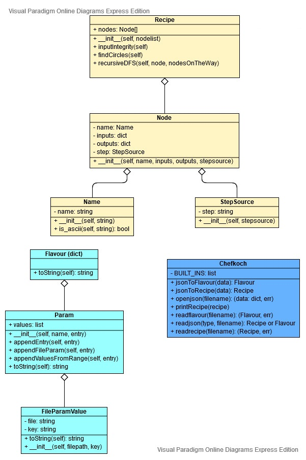

..  Copyright 2019 Christoph Wagner
        https://www.tu-ilmenau.de/it-ems/

    Licensed under the Apache License, Version 2.0 (the "License");
    you may not use this file except in compliance with the License.
    You may obtain a copy of the License at

        http://www.apache.org/licenses/LICENSE-2.0

    Unless required by applicable law or agreed to in writing, software
    distributed under the License is distributed on an "AS IS" BASIS,
    WITHOUT WARRANTIES OR CONDITIONS OF ANY KIND, either express or implied.
    See the License for the specific language governing permissions and
    limitations under the License.

.. _classes:

Classes
=======

The following UML diagram shows everything inside the chefkoch.recipe module. Besides the recipe, it includes classes concerning the flavour file and some functions that belong to no class and are therefore listed under the chefkoch caption. The Recipe class wraps a list of nodes. Nodes consist of a simulation step, a name and inputs as well as outputs to the simulation step. These in- and outputs can be parameters or previous simulation step's outputs. In case, they are parameters, they are found in the flavour file, hence in the Flavour object. There are several possible values for a parameter. Values can even be files.

Please tune in soon for more UML Diagrams to Chef, the main program coordinator, chef the module, the worker, the DB directory, the pantry, a worker's log, the chef init log, the dependency graph, the CLI, the config file and the solution evaluation part of the system.

