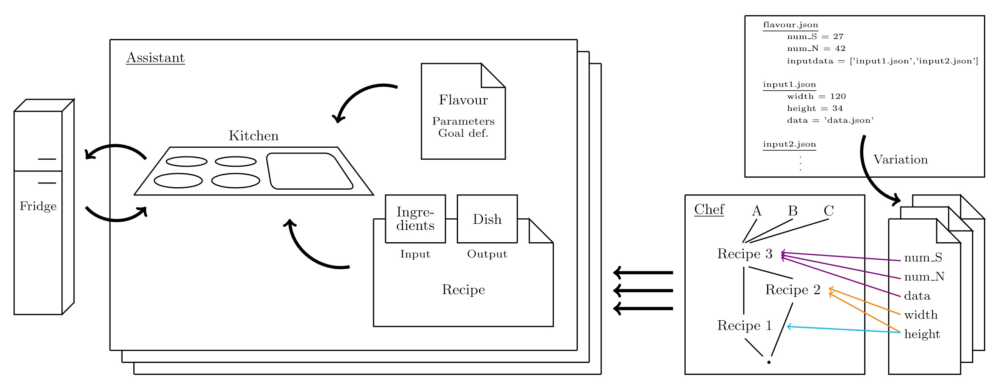

..  Copyright 2019 Christoph Wagner
        https://www.tu-ilmenau.de/it-ems/

    Licensed under the Apache License, Version 2.0 (the "License");
    you may not use this file except in compliance with the License.
    You may obtain a copy of the License at

        http://www.apache.org/licenses/LICENSE-2.0

    Unless required by applicable law or agreed to in writing, software
    distributed under the License is distributed on an "AS IS" BASIS,
    WITHOUT WARRANTIES OR CONDITIONS OF ANY KIND, either express or implied.
    See the License for the specific language governing permissions and
    limitations under the License.

.. toctree::
   :glob:
   :maxdepth: 2
   :hidden:

.. automodule:: chefkoch

Chefkoch under development
--------------------------

Please tune in soon for more details.

Architecture
============

The architecture is described from two points of view. The first explanation is given with regards to the functionality of the system.
The second explanation describes the structure of the software architecture divided into frontend, backend and database.

Chefkoch is a tool to manage the computing process of simulations that are often repeated with only small changes in input or 
parameter data. Starting the simulations and collecting the results manually is a big threat to consistence as it is easy to falsely use
wrong parameters or old intermediate results. Also, it is hard to decide which parts of the simulation need to be repeated and which parts
are not affected by a change to only a few parameters. There is the potencial to save computing time.

The project name Chefkoch which means chef cook evolved from the following conceptual idea.
Chefkoch is the head of the simulation computing process and coordinates different parallel threads as a chef coordinates kitchen
assistants.

	
The picture shows the components of the computing process. In general, there is the fridge that stand for a database, multiple assistants
who represents smaller programs or threads, the kitchen which is the processor the tread runs on and the chef.
As shown in the block of the chef, a simulation is divided into smaller computation steps. There are dependencies between those steps and
the parameters the steps take. Those steps are called recipes. The input of one recipe can be the output of another recipe or some input
data. The possibilities for input data for one simulation is defined in a .json file as shown to the right. The chef produces every
possible set and starts simulations each set of parameters. Therefore, the parameters are further split up to start a simulation step
only with the parameters needed for that step. Not every ingredient is needed for every step in cooking, so the assistant only gets a
list of relevant ingredients and a note concerning the flavour. After an assistant is done, the prepared food goes into the fridge for
another assistant to use.

To make sure, no meals are mixed up and nothing in the fridge gets confused, Chefkoch has got a unique namespace.
There is more than one meal ordered. So the chef works parallel on all of them. 

Classes
=======

UML Diagrams.

Examples for usage
==================

Never seen a simulation, it should compute.

Contributions
-------------

There are many ways you as an individual can contribute. We are happy about feature requests, bug reports and of course contributions in form of additional features. To these ends, please step by at `Github <https://github.com/EMS-TU-Ilmenau/chefkoch>`_ where we organize the work on the package.

Affiliations and Credits
------------------------

Currently the project is maintained by Christoph Wagner at the `EMS group <https://www.tu-ilmenau.de/it-ems/>`_ at `TU Ilmenau  <https://www.tu-ilmenau.de/>`_.
